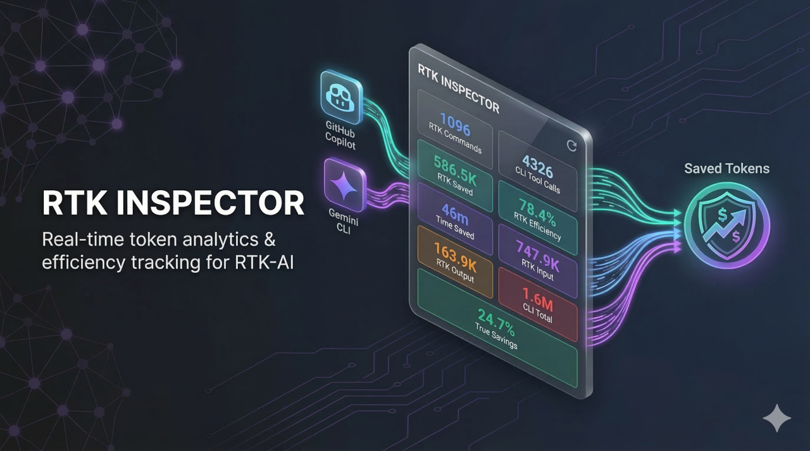
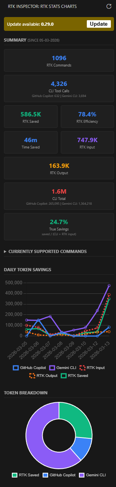

# RTK Inspector

RTK Inspector is a VS Code extension that visualizes how much the [rtk CLI](https://github.com/rtk-ai/rtk) is saving you, then compares those savings against your total AI CLI token usage across the tools you already use.

Install it from the [Visual Studio Marketplace](https://marketplace.visualstudio.com/items?itemName=PeterMEFrandsen.rtk-inspector) or [Open VSX](https://open-vsx.org/extension/petermefrandsen/rtk-inspector), and browse the source on [GitHub](https://github.com/petermefrandsen/rtk-inspector).

## Dashboard preview

## Why RTK Inspector?

- Track **daily RTK savings trends** in a sidebar chart.
- Compare **RTK input, output, saved tokens, and CLI totals** in one place.
- See an honest **True Savings %** calculation: `saved / (CLI total + RTK input)`.
- Review **per-CLI token usage** alongside RTK results.
- Refresh on demand and spot when a newer **rtk CLI** version is available.

## Installation

- [Install from Visual Studio Marketplace](https://marketplace.visualstudio.com/items?itemName=PeterMEFrandsen.rtk-inspector)
- [Install from Open VSX Registry](https://open-vsx.org/extension/petermefrandsen/rtk-inspector)

## What the extension reads

RTK Inspector combines RTK output with local session data from supported AI CLIs.

| Source | Data used |
| --- | --- |
| [rtk CLI](https://github.com/rtk-ai/rtk) | `rtk gain -d -f json` |
| **GitHub Copilot** | `~/.copilot/session-state/*/events.jsonl` |
| **Gemini CLI** | `~/.gemini/tmp/*/chats/session-*.json` |
| **Claude Code** | `~/.claude/projects/**/*.jsonl` |

Only days where RTK has data are included in the CLI comparison, so the numbers stay aligned.

## Requirements and setup

1. Install the [rtk CLI](https://github.com/rtk-ai/rtk).
2. Make sure `rtk` is available in your `PATH`, or set a custom path with `rtk-inspector.executablePath`.
3. Open the **RTK Inspector** view from the Activity Bar.
4. If you use RTK from WSL while VS Code runs on Windows, enable `rtk-inspector.useWsl`.

CLI metrics appear when at least one supported tool has local session data available.

## Usage

1. Open **RTK Inspector** in the Activity Bar.
2. Review the summary cards and charts in the sidebar.
3. Click **Refresh RTK Stats** to reload RTK data and local CLI usage.
4. Expand the commands list in the sidebar to inspect RTK command counts.

## Commands

Use the Command Palette to access:

- `RTK Inspector: Refresh RTK Stats`
- `RTK Inspector: Show RTK Inspector Logs`
- `RTK Inspector: Run RTK Inspector Diagnostics`

## Settings

- `rtk-inspector.executablePath`: path to the RTK executable. Defaults to `rtk`.
- `rtk-inspector.useWsl`: runs RTK through `wsl.exe -e` when VS Code is on Windows and RTK lives in WSL.

## Troubleshooting

If the dashboard does not load as expected:

1. Run `RTK Inspector: Run RTK Inspector Diagnostics`.
2. Open `RTK Inspector: Show RTK Inspector Logs`.
3. Verify that `rtk` runs in your shell, or set `rtk-inspector.executablePath`.
4. On Windows + WSL setups, enable `rtk-inspector.useWsl`.

For Gemini CLI, the extension uses message output and thought tokens from each session entry to avoid inflating totals with cumulative input counts.

## Development

- Repository: [github.com/petermefrandsen/rtk-inspector](https://github.com/petermefrandsen/rtk-inspector)
- RTK CLI: [github.com/rtk-ai/rtk](https://github.com/rtk-ai/rtk)

## License

[MIT](LICENSE)
